class: center, middle


<style type="text/css">
.remark-slide-content {
    font-size: 30px;
    padding: 1em 4em 1em 4em;
}
</style>


```{r setup, include=FALSE}
options(htmltools.dir.version = FALSE)
library(knitr)
opts_chunk$set(
  fig.align="center",  
  fig.height=6, #fig.width=6,
  # out.width="748px", #out.length="520.75px",
  dpi=300, #fig.path='Figs/',
  cache=T#, echo=F, warning=F, message=F
  )
library(tidyverse)
library(hrbrthemes)
library(tufte)
```

# What is credit?

--

Ability to borrow money or access goods or services with the understanding that the borrower will pay it back <br/><br/>

???
payment, credit, and investing.
payment first few classes
we talked about blockchain. a technology, primarily for payment. But can be useful in credit, investing, and other areas outside finance.
Today we start the discussion on credit. We will focus on basics of credit analysis and the problems and limitations of the current system.

goes back to 20,000 to 30,000 years

Q: Who is borrowing?

---

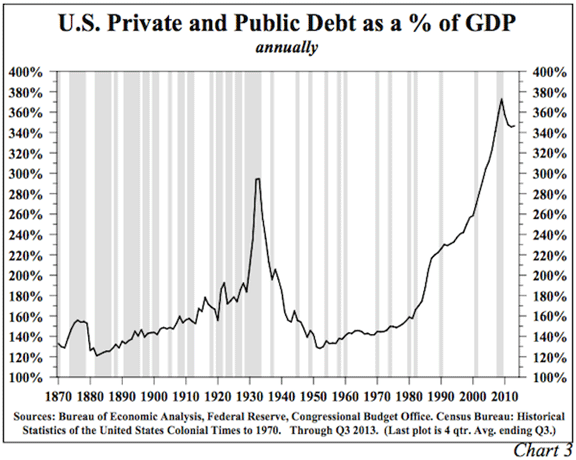
Source: https://www.mauldineconomics.com

???
Q US GDP?

debt is about 350%. Last peaked in 1929. Went passed 300 but coming down since the last financial crisis.

---
# Credit growth overtime

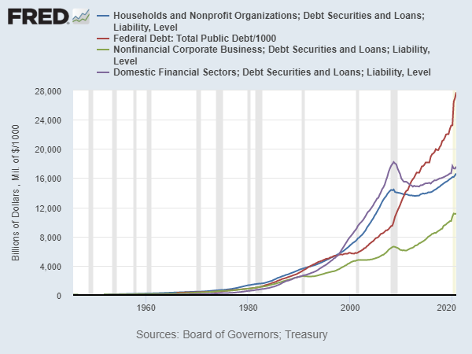

??
debt in modern economies is a big part of how economies work

here are the slices of the us credit market. each about 1/4th
---
# How does credit supply impact the economy?

--

 - ## Boosts household consumption

--

 - ## Increases productive capacity

???
-increase demand leads to economic growth
-investment opportunity, or a great idea. But cannot implement without credit

---
class:middle,center

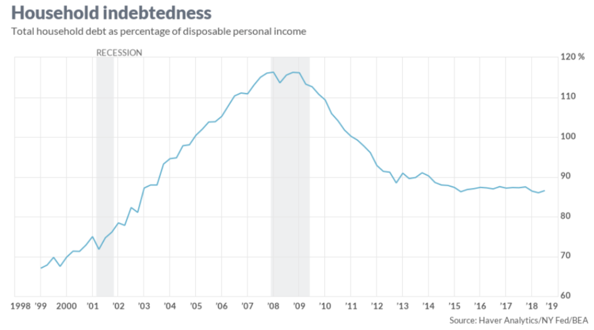
???
Housing bubble, lax lending standards from 2000 to 2007. DF act made is difficult to originate high-risk mortgages.
---
class:middle,center

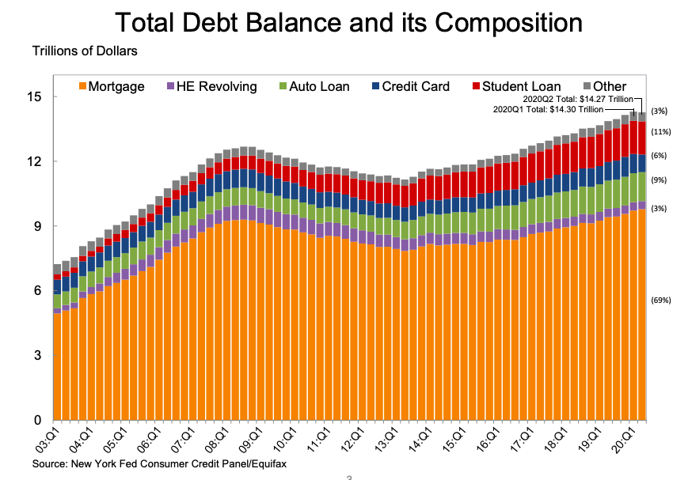
???
primarily mortgage debt
student debt didn't use to be like this
---
class:middle,center

# General Motors Company 
## Balance Sheet

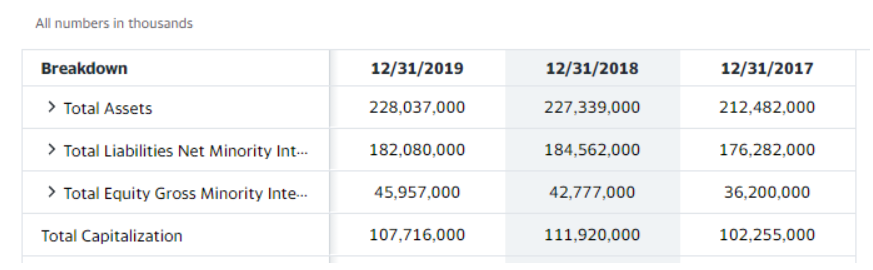
<font size=1>(Source: Yahoo! Finance)</font>
---
# What is credit analysis?

--

- ## Process of determining the ability of a company or person to repay their debt obligations

--

- ## Credit analysis attempts to assign measurable numbers to estimate borrowers' ability to repay (<font color="red">creditworthiness</font>)

???
Q How do you decide whether you should lend to someone?
Lenders filter out bad borrowers.
---

class:middle,center

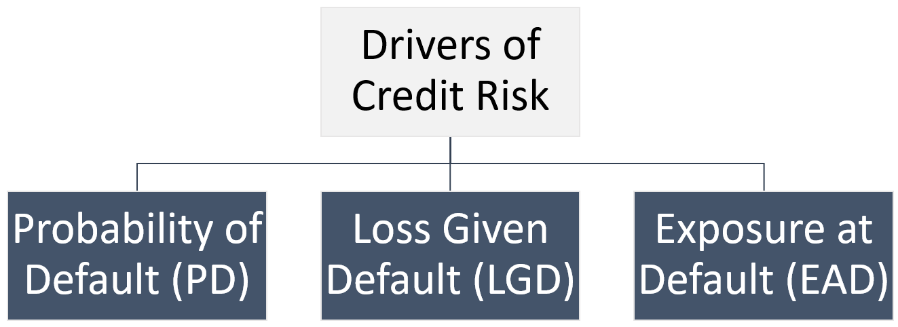

---

# Probability of Defaut (PD)

--

- The probability that the borrower will not be able to make the payments

--

- PD depends on borrower characteristics and the economic environment

--

- Traditionally, the FICO score is used as the main measure of probability of default for individuals

--

- For corporations -> Credit rating (We are going to come back to corporations later. First, we are going to focus on individuals.)

---

# Loss Given Defaut (LGD)

--

- The percentage of money the lender stands to use if the borrower is not able repay

--

- For example, if a borrower who owes $100,000, and is only expected to pay $60,000, the LGD is 40%

--

- Collateral reduces the LGD

???
Lenders filter out bad borrowers.
---

# Exposure at Defaut (EAD)

--

- The amount of loss the lender is exposed to at any particular point, if the borrower stops making payments

--

- As borrowers make loan repayments, the EAD drops.
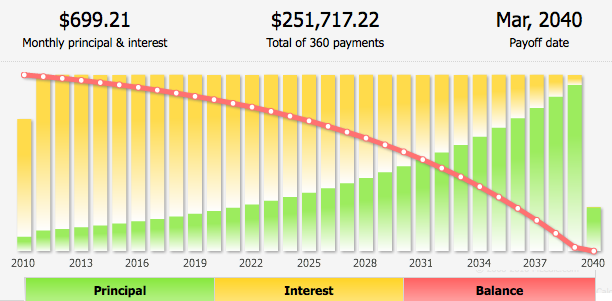
---

# Expected Loss is the main measure of risk

--

--

### The lender's credit decision and the interest rate offered to the borrower is based the 'Expected Loss' estimate
--

### LGD and EAD can be estimated with more certainty, compared to PD

--

## <font color="red">Estimating PD is the key</font>
???
-Example with figures. 100 applicants for 1000 loan with 5pct PD. 5 default. 95 repay. LGD = 100 and EAD = 1000. EL per applicant is 50. EL for 100 applicants is 50 x 100 = 5000. If the lender can recover this 5000 from the 95 borrowers, then this is an acceptable loan. 
-Interest rate limits (Usury) don't allow lenders to charge a sufficiently high interest rate. Then no credit.
---
# Pricing Credit Risk

### 100 applicants. Each loan $1,000
### PD = 5%, LGD = 100%, EAD = 100%
### Expected Loss = 5% * 100% * 100% * 1000 = 50
### Expected Loss for 100 applicants = 50 * 100 = 5000
### Lender should recover this $5,000 from 95 borrowers. (Interest Rate)
### Interest rate limits (Usury) don't allow lenders to charge a sufficiently high interest rate. Then no credit


---
# 28/36 rule 

> "The term 28/36 rule refers to a common-sense rule used to calculate the amount of debt an individual or household should assume. According to this rule, a household should spend a maximum of 28% of its gross monthly income on total housing expenses and no more than 36% on total debt service, including housing and other debt such as car loans and credit cards. Lenders often use this rule to assess whether to extend credit to borrowers." - Investopedia

---
# FICO score as the standard measure of PD


---

# The FICO Score

--

- Developed by the Fair Isaac Corporation

--

- Based on the outstanding debt, payment history, length of
credit usage, mix of credit used, and credit inquiries

--

- Use data from credit records maintained by the three
nationwide credit reporting agencies: TransUnion, Equifax, and Experian

--

- A reasonable measure of creditworthiness

--

- Used for other purposes such as employment and immigration

---

# High FICO Score -> Less likely to default

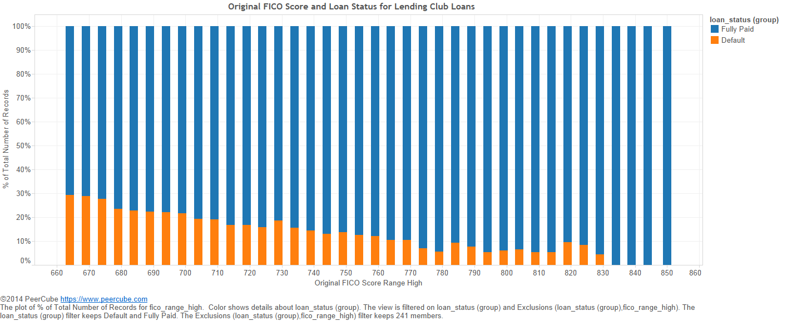

---

class:middle,center

## What about the credit invisibles?

### One in every ten adults does not have any credit history 

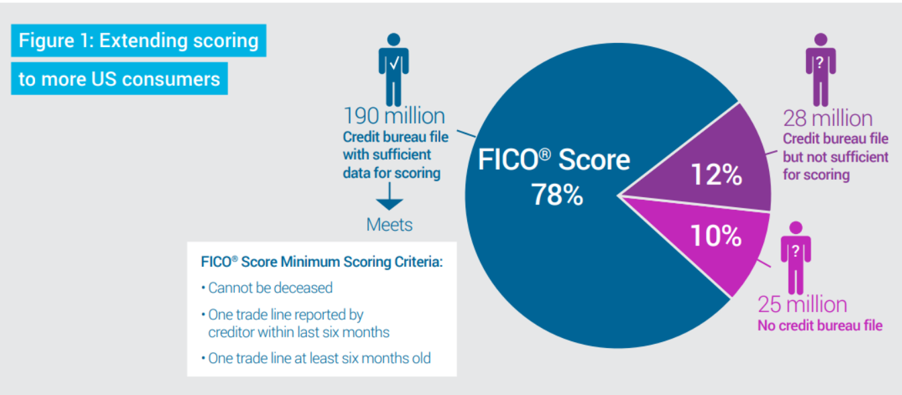

???
- recent college graduates
- recent immigrants
- someone unknowingly made a mistake
---
# Credit Invisibles: by age

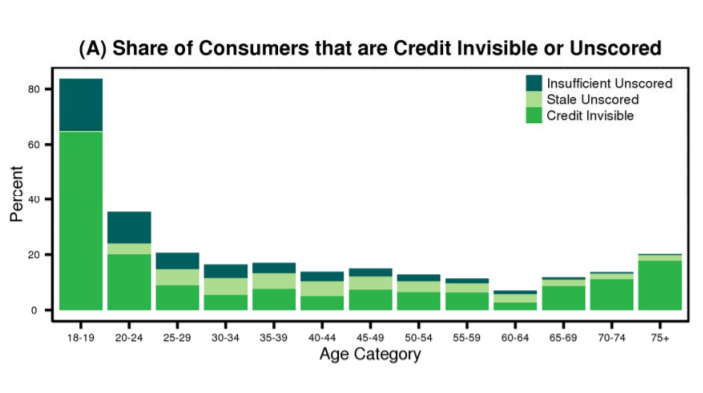
<font size=3>Source:https://files.consumerfinance.gov/f/201505_cfpb_data-point-credit-invisibles.pdf</font>
---
# Credit Invisibles: by income

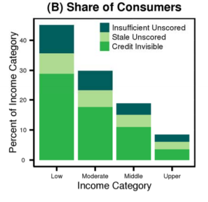
<font size=3>Source:https://files.consumerfinance.gov/f/201505_cfpb_data-point-credit-invisibles.pdf</font>

---
# Credit Invisibles: by race

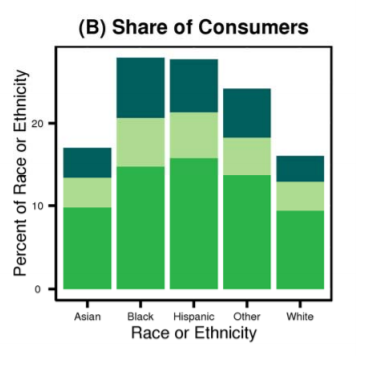
<font size=3>Source:https://files.consumerfinance.gov/f/201505_cfpb_data-point-credit-invisibles.pdf</font>

---
# Credit invisibles

--

Tend to be

--

- Younger

--

- Low-income

--

- Minority

--

### Credit invisibles face **higher costs for borrowing** (such as payday lenders) money and **barriers to housing and employment**

<font size=3>Source:https://files.consumerfinance.gov/f/201505_cfpb_data-point-credit-invisibles.pdf</font>

---

# Banks are focused on prime borrowers

--

- Less risk

--

- Easy to identify (high FICO)

--

<br/>
<br/>

> ### but, "The U.S. is now a non-prime nation defined by lack of savings and income volatility." - Ken Rees


---

# Huge potential for fintech lenders

--

- 53 million credit invisibles

--

- 79 million Americans with credit scores below 680 (subprime)
  * Traditional lenders are unlikely to lend to this segment or more likely to charge a very high interest rate
  
--

- People need credit
  * 40% doesn't have enough savings to cover an emergency expense of $400
  * 1/3 have incomes that fluctuate monthly
  
---

class: middle, center

# Fintech lenders try to identify "credit invisibles" using alternative data and machine learning

<br/>
<br/>
>“While [credit invisibles] lack traditional credit data, they have plenty of other financial information that could help predict their ability to repay a loan” - Jason Gross, co-founder and CEO of Petal, a fintech lender.
---

class: middle, center

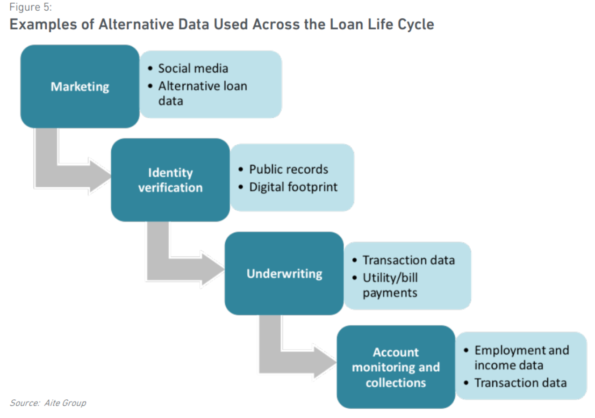
---

class: middle, center

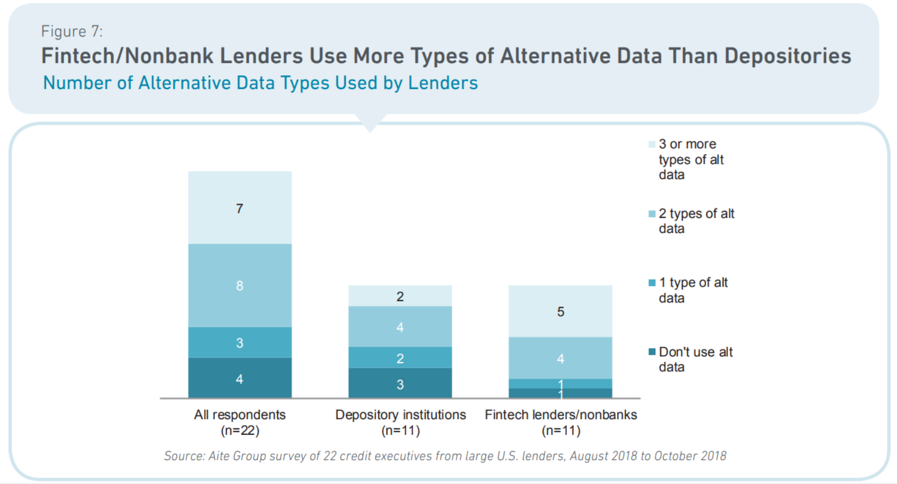
---
# Presentations

- Team 01: Prosper

- Team 02: SoFi

- Team 03: Zopa

- Team 04: Upstart

- Team 05: Ezubao


---
# Readings

- [How Fintech Serves the ‘Invisible Prime’ Borrower](https://knowledge.wharton.upenn.edu/article/fintech-serving-invisible-prime-borrower/)

- [Bringing 'Credit Invisibles' Out of the Dark](https://www.wsj.com/articles/SB10000872396390443995604578003872577102686)

- [Is Fintech More Fin Than Tech?](https://www.youtube.com/watch?v=koOH4Hs2s9A)

- [For 'Credit Invisibles,' A Market Takes Shape](https://www.wsj.com/articles/SB10001424127887324307204578129060604412552)
