class: center, middle

<style type="text/css">
.remark-slide-content {
    font-size: 30px;
    padding: 1em 4em 1em 4em;
}

@page { margin: 0; }
@media print {
  .remark-slide-scaler {
    width: 100% !important;
    height: 100% !important;
    transform: scale(1) !important;
    top: 0 !important;
    left: 0 !important;
  }
}

</style>


```{r setup, include=FALSE}
options(htmltools.dir.version = FALSE)
library(knitr)
opts_chunk$set(
  fig.align="center",  
  fig.height=6, #fig.width=6,
  # out.width="748px", #out.length="520.75px",
  dpi=300, #fig.path='Figs/',
  cache=T#, echo=F, warning=F, message=F
  )
library(tidyverse)
library(hrbrthemes)
library(tufte)
```

# Traditional lending process

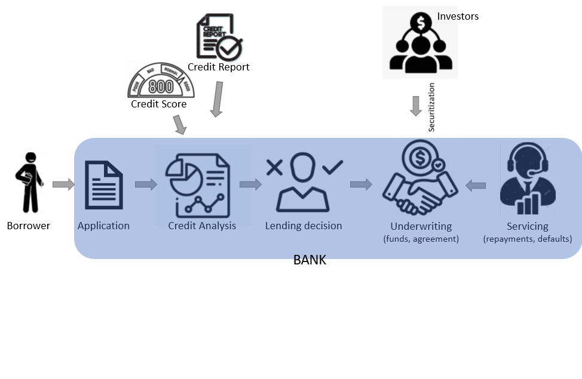

---

# Role of Fintech Lenders
<br/>
Fintech firms can leverage technology to implement the application and decision parts more efficiently and effectively. 

<br/>

Technology-enabled models to rapidly underwrite borrower credit risk to determine appropriate loan pricing, terms and amounts offered to borrowers

---

class: middle, center

# Role of Fintech Lenders

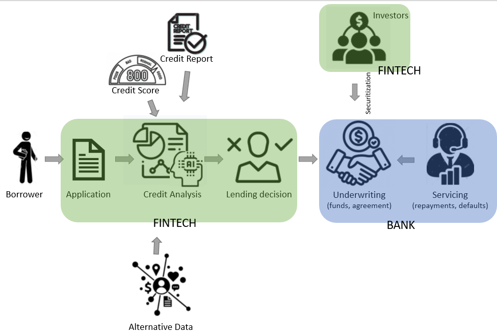

---
class:middle,center

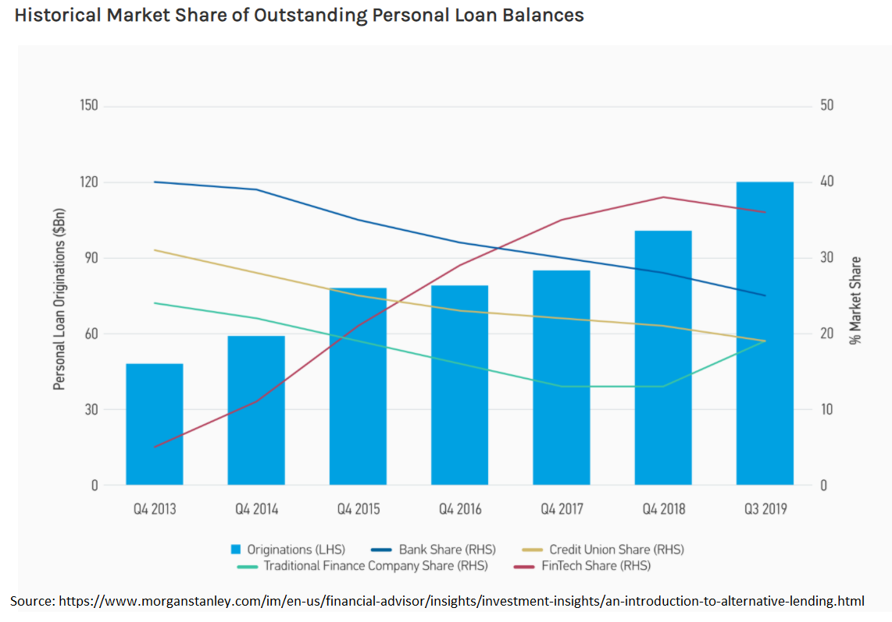

---
class: middle,center

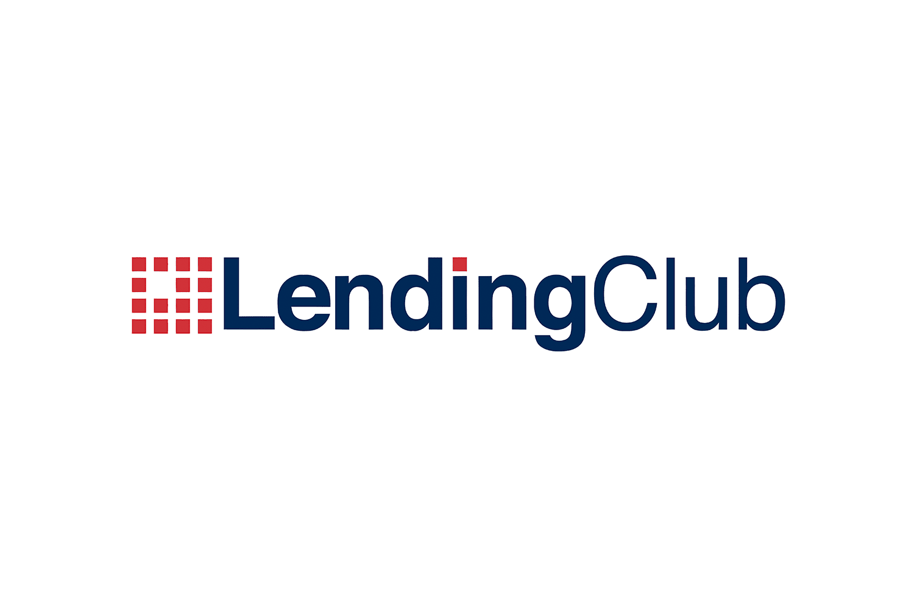
---
# LendingClub

- World's largest peer-to-peer lending platform
- Headquartered in San Francisco, California
- Enables borrowers to create unsecured personal loans between \$1,000 and \$4,000.
- In 2020, LendingClub acquired Radius Bank, and loans are no longer available for individual investing

---

# LendingClub - Lending Process

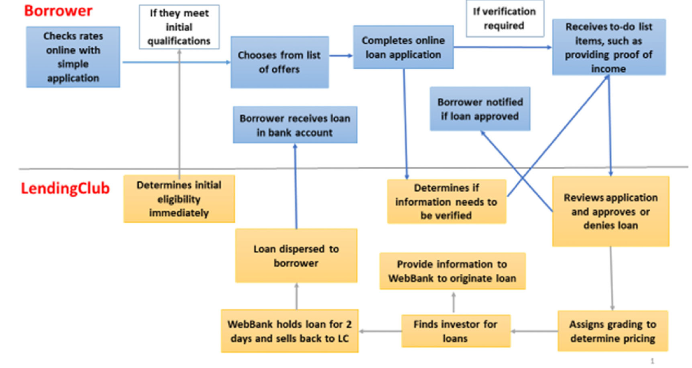
<font size=1><p>(Source: Jagtiani, J., & Lemieux, C. (2019). The roles of alternative data and machine learning in fintech lending: evidence from the LendingClub consumer platform. Financial Management, 48(4), 1009-1029.)</p></font>
---

## Alternative data in assigning rating grades has been increasing over the years

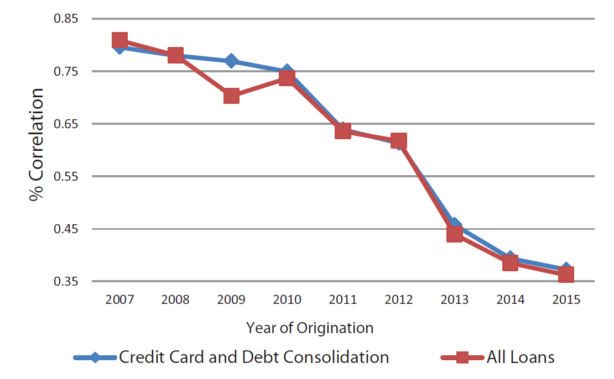
<font size=1><p>(Source: Jagtiani, J., & Lemieux, C. (2019). The roles of alternative data and machine learning in fintech lending: evidence from the LendingClub consumer platform. Financial Management, 48(4), 1009-1029.)</p></font>
---

## FICO distribution over the years

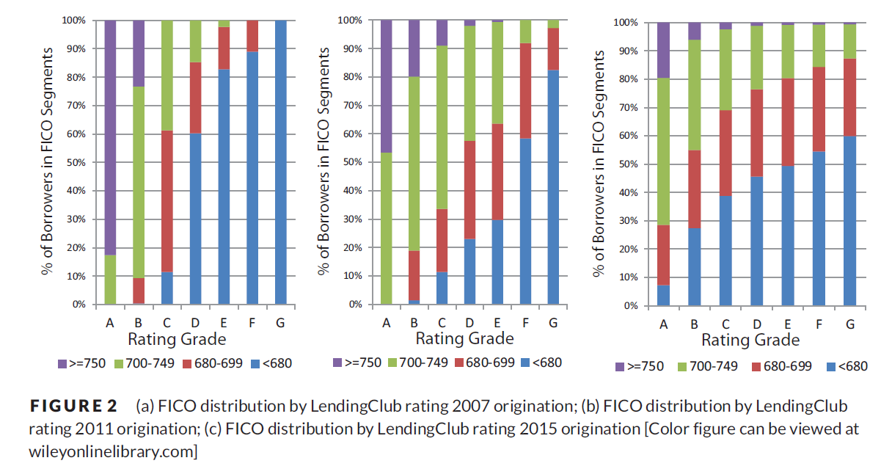
<font size=1><p>(Source: Jagtiani, J., & Lemieux, C. (2019). The roles of alternative data and machine learning in fintech lending: evidence from the LendingClub consumer platform. Financial Management, 48(4), 1009-1029.)</p></font>
---
### LendingClub is able to identify invisible prime borrowers using alternative data and machine learning

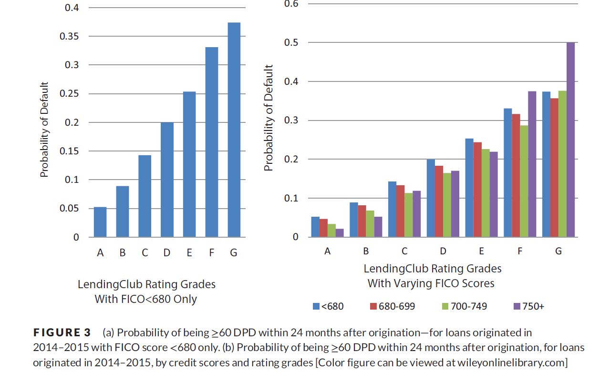
<font size=1><p>(Source: Jagtiani, J., & Lemieux, C. (2019). The roles of alternative data and machine learning in fintech lending: evidence from the LendingClub consumer platform. Financial Management, 48(4), 1009-1029.)</p></font>
---
### Defaults decreased over the years

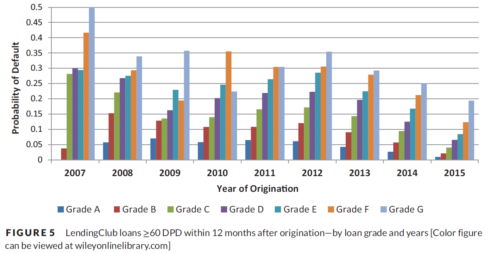
<font size=1><p>(Source: Jagtiani, J., & Lemieux, C. (2019). The roles of alternative data and machine learning in fintech lending: evidence from the LendingClub consumer platform. Financial Management, 48(4), 1009-1029.)</p></font>
---
# Student Presentations

Each team studies the organization assigned and makes a 10 minute presentation. The presentation should focus on how each organization is using technology in their business model and compare that to the traditional model.

- Team **01**: Prosper
<br/>

- Team **02**: SoFi
<br/>

- Team **03**: Zopa
<br/>

- Team **04**: Upstart


---

# Investors in Marketplace Lending

- Prosper example

---

# Marketplace lending has the potential to improve financial inclusion in **emerging markets**

--

- Largely unbanked population

--

- Growing smartphone and internet usage

--

- Absence  of centralized credit databases

---
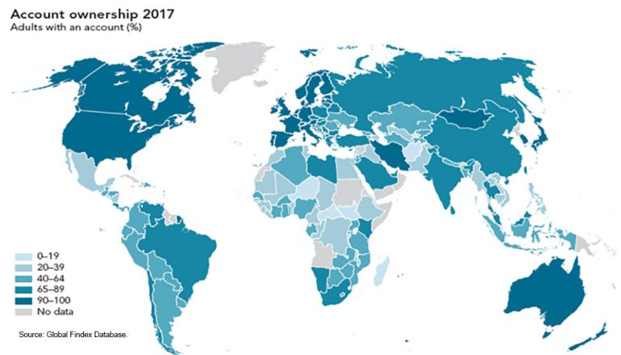

<font size=1><p>(Source: finca.org)</p></font>
---

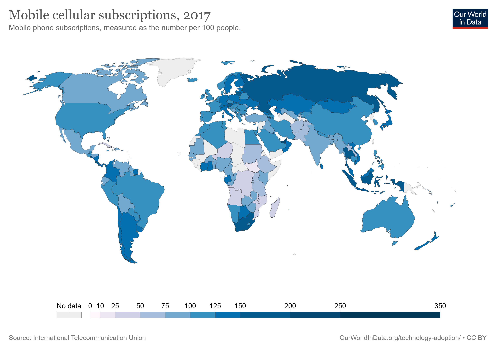

<font size=1><p>(Source: https://ourworldindata.org/)</p></font>
---

#  Regulation tightening in China

--

- China became a major fintech market power post financial crisis as investors flocked to peer-to-peer platforms searching for higher yield
  * By July 2017, there were 5029 P2P platforms with over 1.09 trillion RMB (163 billion USD) in outstanding loans
  * 69% of the population used fintech services
--

- The downfall of Ezubao in 2015 highlighted the risks in peer-to-peer lending. 1/3 fintech lenders had cash shortage problems.
  * Created fictional borrowers and funneled money to own business

---

#  Regulation tightening in China

--

- Concerns about loan sharking, identity theft, consumer privacy violations, and misleading marketing

--

- Security breaches 

--
- Regulators imposed stricter regulations
  * Appointment of custodian banks
  * Disclosure requirements on the use of investments
  * Caps on the maximum lending amounts 
  
???
 some Chinese P2P platforms monitored the borrowers’ smartphone use without permission, and collected data such as phone contact lists, call logs, and location services to track defaulting borrowers and harass their family and friends
 
Online lenders on Jiedaibao, a P2P platform, targeted female college student borrowers and demanded “naked loans” - nude photos and videos as collateral to be eligible for higher loan amounts. Lenders threatened to publish the photos online if the payments were not on time
---

class:middle,center

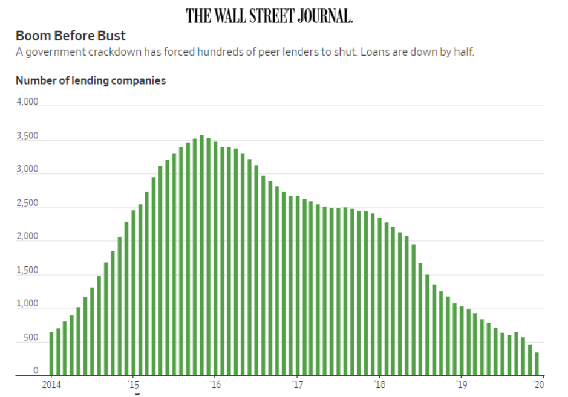
---

# Student Presentation

- Team **05**: Ezubao

