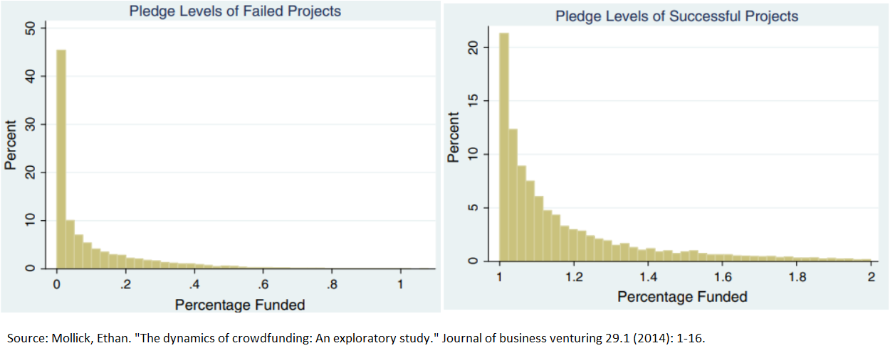

<style type="text/css">
.remark-slide-content {
    font-size: 30px;
    padding: 1em 4em 1em 4em;
}

@page { margin: 0; }
@media print {
  .remark-slide-scaler {
    width: 100% !important;
    height: 100% !important;
    transform: scale(1) !important;
    top: 0 !important;
    left: 0 !important;
  }
}

</style>


```{r setup, include=FALSE}
options(htmltools.dir.version = FALSE)
library(knitr)
opts_chunk$set(
  fig.align="center",  
  fig.height=4, #fig.width=6,
  # out.width="748px", #out.length="520.75px",
  dpi=300, #fig.path='Figs/',
  cache=T#, echo=F, warning=F, message=F
  )
library(tidyverse)
library(hrbrthemes)
library(tufte)
```


## Crowdfunding draws small capital contributions from a large number of individual backers

--
A novel way of financing without seeking for venture capital.
  * Legalized by 2012 JOBS Act
--
<br/>
<br/>

Three types of crowdfunding
  * Rewards based
  * Equity based
  * Crypto based

---
class: inverse, middle, center

# Rewards Based Crowdfunding
---
 
 Reward based -> e.g.: kickstarter
 
 preselling
 
 proceed if the minimum funding goal is met
 
 participants are not speculating. just want the product.
 
 No punishment if the development is unsuccessful
 
 Successful projects can lead to potential VC attention.

---

# Student Presentation

- Team **05**: Kickstarter
---

# Growth of Kickstarter
```{r echo=FALSE}
library(data.table)
library(ggplot2)
```

```{r echo=FALSE}
ks <- fread("https://raw.githubusercontent.com/ayoubabozer/kickstarter/master/ks-projects-201801.csv")
ks[,year:=as.numeric(substr(launched,1,4))]

noofproj <- ks[,.N,by=year]
```

```{r echo=FALSE}
ggplot(noofproj[year %in% 2009:2017],aes(x=year,y=N))+geom_line(size=2,color="dodgerblue")+theme_minimal()+labs(x="",y="Number of projects")+scale_x_continuous(breaks=2009:2017)
```

---
# Number of backers per project

```{r echo=FALSE,message=FALSE}

ggplot(ks[state=="successful" & backers<500,],aes(x=backers))+geom_histogram()+theme_minimal()+labs(y="Number of projects",x="Number of backers")

```

---

# Types of projects


```{r echo=FALSE,message=FALSE}
projtypes <- ks[state=="successful",.N,by=main_category]

ggplot(projtypes,aes(x=reorder(main_category, N),y=N))+geom_bar(stat = "identity",fill="skyblue",alpha=0.7)+theme_minimal()+labs(y="Number of projects",x="")+
  theme(axis.text.x = element_text(angle=90, size=7))


```

---
# Total amount pledged

```{r echo=FALSE, message=FALSE}
library(scales)
amount <- ks[,.(amt=sum(usd_pledged_real)),by=year]

ggplot(amount[year %in% 2009:2017],aes(x=year,y=amt))+geom_line(size=2,color="dodgerblue")+theme_minimal()+labs(x="",y="Total amount pledged")+scale_x_continuous(breaks=2009:2017)+ scale_y_continuous(labels = comma)
```

---

# 48% of Kickstarter projects raised their goal


---

# 25% of the projects delivered on time


---
class: inverse, middle, center

# Equity Based Crowdfunding


---

Average investor is not able to invest in private equity
- Accredited investors SEC 

JOBS Act allowed small companies to raise capital from non-accredited investors.

Reg CF/Equity III - up to $1 m
  Simple filing requirements
  Similar to kickstarter type projects
  Origination fee of about 5% by the platforms
  Platforms sometimes take an equity stake. Skin in the game. Conflict of interest.

Reg D/Equity I - Unlimited offering to accredited investors
  e.g: Angellist
---

class: inverse, middle, center

# Crypto Based Crowdfunding (ICOs)

---

# What is an Initial Coin Offering (ICO)?
* Used to  raise money for younger startups by going around the capital markets

--
* Individuals are offered digital assets that represent products or services 
  
--
* Raise funding through blockchain
  - Anyone can use Bitcoin source code to create own coins
  - The standardized the coding for creating a token in Ethereum made it easy to create new coins

???
 a significant innovation in entrepreneurial finance
 
Venture capital firms (VCs) concentrated in a few areas such as Silicon Valley are the dominant investors. For entrepreneurs seeking capital, physical proximity to and personal connections with VCs are crucial 

permit a broader range of individuals to invest in high-risk, high-reward new ventures while enabling entrepreneurs who lack access to networks of conventional investors to raise financing
---

# Types of digital assets

1. Coins
    - General purpose medium of exchange and store of value cryptocurrency
    
--

2. Security tokens
    - Creates a record of ownership

--

3. Utility tokens
    - Give holders the right to access a product or a service
    - Most popular
    - Value increases with the value of the network

---


(source: www.ifec.org.hk)
---

# ICO growth


(Source: Momtaz, Paul P. "Initial coin offerings." Plos one 15.5 (2020): e0233018.)

---

# Tokens are tradable for cryptocurrency or fiat currency within a few days of the ICO


---

# Student Presentation

- Filecoin

---

# There are many ICO related scams

No mechanism to prevent the issuer from absconding with the ICO proceeds

There is no accountability or oversight of promoters’ use of proceeds

[Buyer Beware: Hundreds of Bitcoin Wannabes Show Hallmarks of Fraud](https://www.wsj.com/articles/buyer-beware-hundreds-of-bitcoin-wannabes-show-hallmarks-of-fraud-1526573115)
---

# Student presentation

[block.one](https://www.wsj.com/articles/chasing-the-next-bitcoin-investors-shell-out-700-million-for-coins-with-no-purpose-1513602000)
---
# Readings
* [Coin Offerings Are Hot, but What Are They?]()