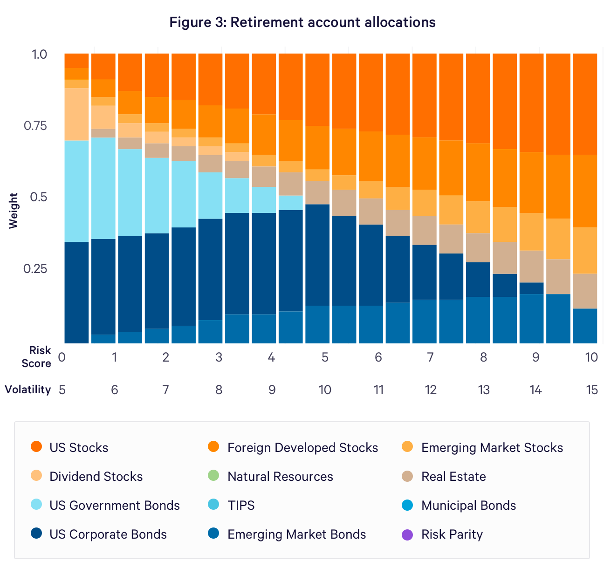
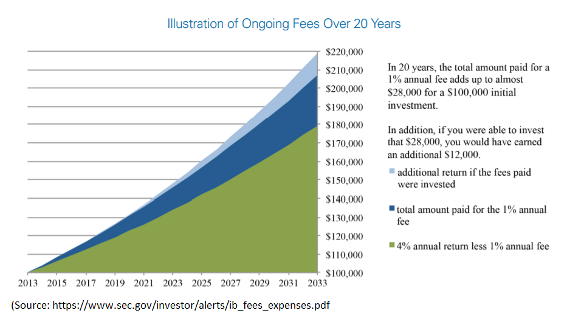
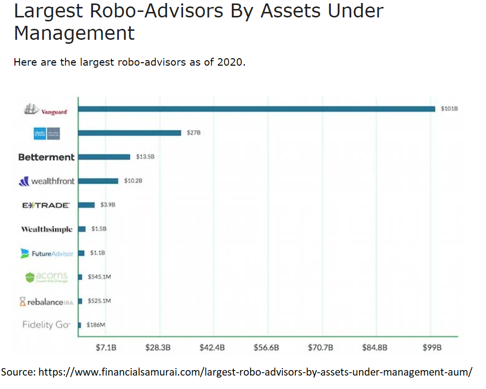

<style type="text/css">
.remark-slide-content {
    font-size: 30px;
    padding: 1em 4em 1em 4em;
}

@page { margin: 0; }
@media print {
  .remark-slide-scaler {
    width: 100% !important;
    height: 100% !important;
    transform: scale(1) !important;
    top: 0 !important;
    left: 0 !important;
  }
}

</style>


```{r setup, include=FALSE}
options(htmltools.dir.version = FALSE)
library(knitr)
opts_chunk$set(
  fig.align="center",  
  fig.height=4, #fig.width=6,
  # out.width="748px", #out.length="520.75px",
  dpi=300, #fig.path='Figs/',
  cache=T#, echo=F, warning=F, message=F
  )
library(tidyverse)
library(hrbrthemes)
library(tufte)
```

# Asset Allocation

* Gauge Risk tolerance
  - Based on age, income, assets
  - Questions such as: what would you do in a market downturn?
  
* Understand return objectives

* Select the optimal portfolio

---

---

# Case for Professional Financial Advise

- Investing is a difficult challenge
  * Complex financial markets
  * Need to understand risk, tax implications, and how to stage withdrawals
  
  
- Investors are subject to various behavioral biases

---

# Fees

- 1.75 to 2% of assets under management


---
class:middle,center

## Robo-advisors as an alternative to Human Advisors

Use data supplied by investors to create and automatically manage their investment portfolios inexpensively.

---

# Robo advising

* Based on an online questionnaire

* Use index Exchange Traded Funds (ETFs) to minimize fees

* Automatically rebalance portfolios

---


---

# Student Presentations

- Team **04**: Vanguard’s Personal Advisor Services
<br/>


- Team **05**: Marcus by Goldman Sachs

