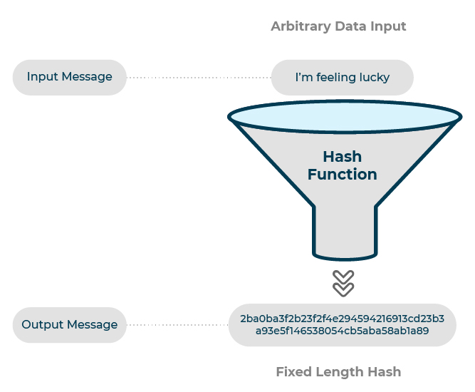

<style type="text/css">
.remark-slide-content {
    font-size: 30px;
    padding: 1em 1em 1em 1em;
}
</style>


```{r setup, include=FALSE}
options(htmltools.dir.version = FALSE)
library(knitr)
opts_chunk$set(
  fig.align="center",  
  fig.height=6, #fig.width=6,
  # out.width="748px", #out.length="520.75px",
  dpi=300, #fig.path='Figs/',
  cache=T#, echo=F, warning=F, message=F
  )
library(tidyverse)
library(hrbrthemes)
library(tufte)
```


# What is R?

* R is a dialect of the S language. S language was developed by John Chambers as an internal statistical environment.
* Created in 1991 by Ross Ihaka and Robert Gentlemen. Announced to the public in 1993.
* It is free! Very active and vibrant user community.
* Facilitates data manipulation, calculation, and graphics.
* Base system runs most fundamental functions
    + Need packages for other specific tasks
* More info: https://www.r-project.org/about.html

---
# Getting started
* Installing R (https://www.r-project.org/)
* Installing R Studio
    + RStudio is a free, open source IDE (integrated development environment) for R
    + User friendly
    + https://www.rstudio.com/products/rstudio/download/
    + We are going to be using R studio to write code
        - script
        - console`
        - environment
* [Beginner's guide](https://github.com/dratnadiwakara/fin4820/blob/master/r4beginners_v3.pdf), [Getting started](https://support.rstudio.com/hc/en-us/articles/201141096-Getting-Started-with-R)

---
## RAM and HDD
RAM and HDD, are both types of computer memory. RAM is used to store computer programs and data that CPU needs in real time. It is a working memory of the computer. RAM data is volatile and is erased once computer is switched off. HDD, hard disk has permanent storage and it is used to store user specific data.
## Types of objects
1. character: "LSU"
2. numeric: 5.5342
3. integer: 7
4. logical: TRUE, FALSE or T,F for short
5. factor: categorical variables, male or female
---
## Assignment operator
- `<-` symbol is the assignment operator
```{r}
x <- 1
y <- 2
x+y
text <- "hello"
print(text)
```
---

# Vector: a combination of same class
```{r}
a <-c("a","b","c")
print(a)
```

```{r}
b <- 1:10 
# : operator is used to create integer sequence
print(b)
print(b[4:8])
```
---

## List: contains elements of different types
Unlike vectors, a list can contain other lists.

```{r}
block_genesis <-  list(
  index = 1,
  timestamp = Sys.time(),
  data = "Genesis Block",
  previous_hash = "26cdc16a4560df5fa2fd521dbca22670",
  new_hash = "2eef25bf0bc4ee81e8c7cd1dfda65855b4b",
  proof = 1
  )
```
---
# R Scripts
* A script is a good way to keep track of what you’re doing
* If you have a long analysis, and you want to be able to recreate it later, a good idea is to type it into a script
* R scripts are saved as ‘.R’ files and can be opened later and rerun the analysis
* Any command that begins with character ‘#’ is ignored when scripts are executed. These are called comments
* To create an R Script use the following steps in RStudio
    - File > New File > R Script
    - Save the file
* To run the script press: Ctrl + Alt + R
* To run a particular line(s), click on the line(s) and press: Ctrl + Enter
---
# Control Structures
Control structures allow programmer to control the structure of the program. We are going to talk about `if else`, `for`, `while`, etc. 
---

# if-else conditions
Suppose you want to assign a credit rating based on the probability of default. If the probability of default is less than 1% the credit rating would be 'A'. If the probability of default is greater than 1% but less than 5% we want to assign a credit rating of 'B'. 5% or greater probability of default would be assigned a rating of 'C'.

```{r}
pd <- 6
creaditrating <- NA

if( pd < 1) {
  creaditrating <- "A"
} else if( pd < 5) {
  creaditrating <- "B"
} else {
  creaditrating <- "C"
}

print(paste("Credit rating is:",creaditrating))
```
---
# for loop

Print each number in the following vector
```{r}

numbervec <- c(5,7,9)

for( val in numbervec ) {
  print(val*val)
}


```
---

# Functions
A function is a block of code that is used to perform a task. A function typically takes and input, executes the block of code, and returns a value. <br/>
<br/>
More: https://www.youtube.com/watch?v=Pi0Yf-jn7O8

## A function to add 2 numbers
```{r}
add2 <- function(a,b) {
  output = a+b
  return(output)
}
```


```{r}
add2(2,6)
```
---
# Packages
R packages are collections of functions and data sets developed by the community. They increase the power of R by improving existing base R functionalities, or by adding new ones. For example, if you are usually working with data frames, probably you will have heard about ggplot2 or data.table, two of the most popular R packages.


## Installing Packages
```{r eval=FALSE}
install.packages("package")
```
## Loading a package
```{r eval=FALSE}
library(package)
```
---
class: center,middle

#Hashing

---
# Hashing
* Hasing algorithms produce a unique, fixed-length string for any given piece of data. 
* A hashing algorithm can take that data and run a complex calculation on it and output a fixed-length string as the result of the calculation. 
* The result is the file’s hash value.
* One-way encryption
* Efficiently computed
* Collision resistant: infeasiable that Hash(x)=Hash(y)
---
class: center,middle

<br />(source: https://digitalkites.com/blog/hashing-guide/)
---
class: center, middle

## The Earth has roughly $7.5 \times 10^{18}$ grains of sand, or seven quintillion, five hundred quadrillion grains
<br />
<br />

--
## How many possible hashes are there?
--
$2^{256}=1.1579209 \times 10^{77}$ combinations
---
# digest function

>The digest function applies a cryptographical hash function to arbitrary R objects. By default, the objects are internally serialized, and either one of the currently implemented MD5 and SHA-1 hash functions algorithms can be used to compute a compact digest of the serialized object.

>In order to compare this implementation with others, serialization of the input argument can also be turned off in which the input argument must be a character string for which its digest is returned.

(source: https://www.rdocumentation.org)


We will use the [digest](https://cran.r-project.org/web/packages/digest/index.html) package to generate the hashes.
---
## Installing and loading digest package

```{r eval=FALSE}
install.packages("digest")
```


```{r}
library(digest)
```

```{r}
digest("Louisiana State University", "sha256")
```

**Avalanche effect**: if an input is changed slightly, the output changes significantly.
```{r}
digest("Louisiana State university", "sha256")
```