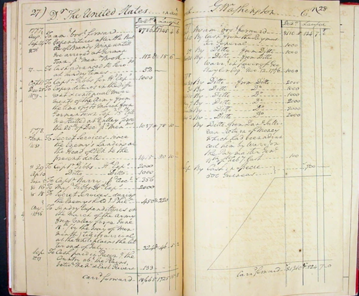
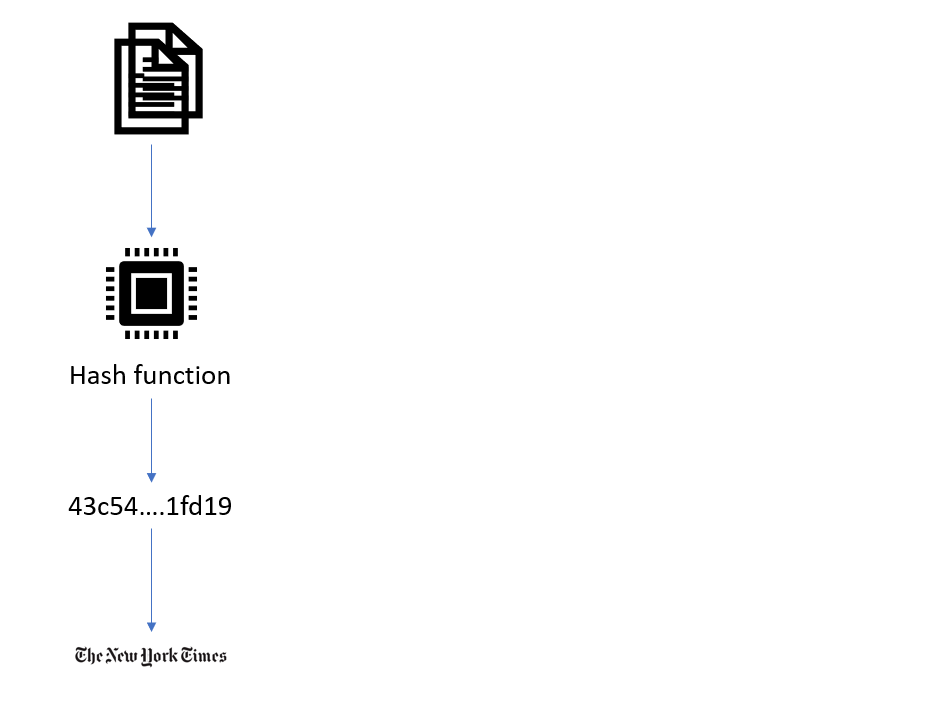
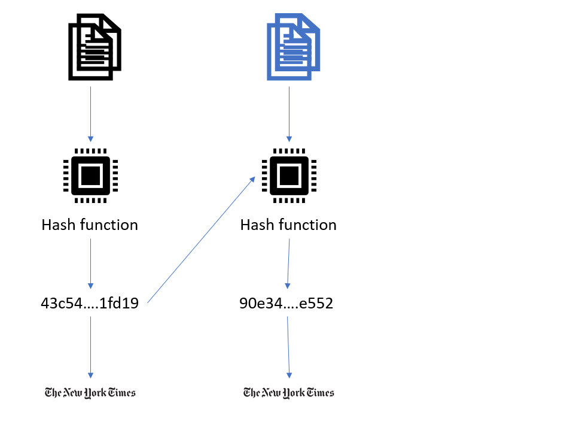
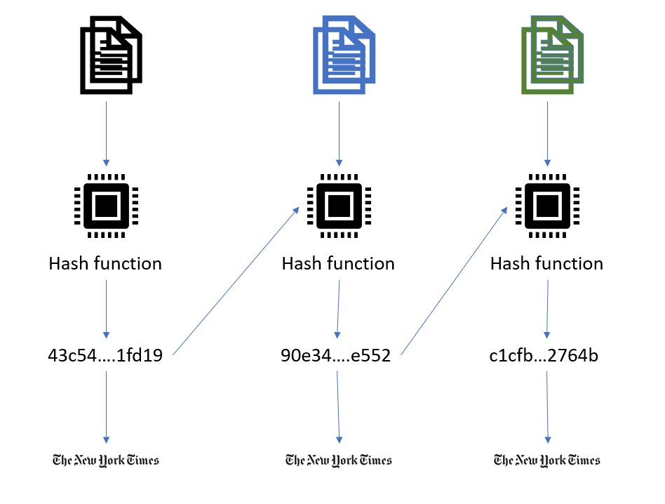
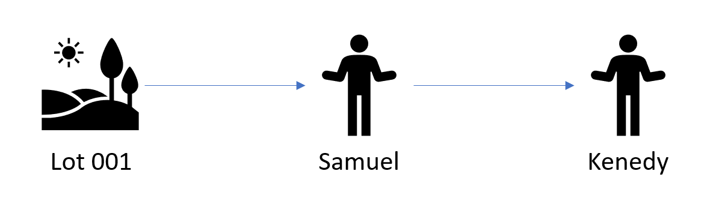

<style type="text/css">
.remark-slide-content {
    font-size: 30px;
    padding: 1em 1em 1em 1em;
}
</style>


```{r setup, include=FALSE}
options(htmltools.dir.version = FALSE)
library(knitr)
opts_chunk$set(
  fig.align="center",  
  fig.height=6, #fig.width=6,
  # out.width="748px", #out.length="520.75px",
  dpi=300, #fig.path='Figs/',
  cache=T#, echo=F, warning=F, message=F
  )
library(tidyverse)
library(hrbrthemes)
library(tufte)
```


# Objective


The objective is to learn how a generic blockchain works and understand some of the terminology through implementing a simple example.

---

# What is a Blockchain?

--

* A ledger

--
* Append only

--
* Distributed

--

<br/>

[Wikipedia](https://en.wikipedia.org/wiki/Blockchain) defines a Blockchain as:

> a continuously growing list of records, called blocks, which are linked and secured using cryptography. Each block typically contains a hash pointer as a link to a previous block, a timestamp and transaction data.
---

## George Washington's Ledger



---

### Every block holds some data, a hash, and points to the previous block
--

### The hash is generated from all the information in the block
--

### If any information in the block changes, the hash changes
--

### A block cannot be altered retroactively without the alteration of all subsequent blocks and the collusion of the network
---

## Blockchains were first invented by the cryptographers Stuart Haber and Scott Stornetta in 1991


```{r, out.width = "200px"}

```

--
### a way to timestamp digital documents to verify their authenticity

---

---

---

---
## Example: Donation Land Claims (DLC) - Oregon Territory 



---
## A block consists of the following:

- Index  

- Timestamp  

- Data  

- Hash of the previous block

- Hash of the current block

- *Consensus system* 

---

## Creating a block

### Load `digest` package
```{r}
library(digest)
```

### A list as a block

```{r}
genesisblock <- list(
                  index=1,
                  timestamp = Sys.time(),
                  previousHash=0, 
                  data="Genesis block",
                  thisHash = NA
                )
```

---

## Setting the hash

```{r}
digest(genesisblock,algo = "sha256")
```

```{r}
genesisblock$thisHash <- digest(genesisblock,algo = "sha256")
print(genesisblock)
```

---

## Convert to a block

```{r}
genesisblock <- list(genesisblock)

print(genesisblock)
```

---

## Initialize the Blockchain

```{r}
blockchain <- NULL
```

## Add the genesis block to the blockchain
```{r}
blockchain <- c(blockchain,genesisblock)

print(blockchain)
```

---

## New transaction

```{r}
newblock <- list(
                  index=length(blockchain)+1,
                  timestamp = Sys.time(),
previousHash=blockchain[[length(blockchain)]]$thisHash, 
                  data="Lot 001 was granted to Samuel",
                  thisHash = NA
                )
```

--
```{r}
newblock$thisHash <- digest(newblock,algo="sha256")
```

```{r}
newblock <- list(newblock)

print(newblock)
```

--- 

## Append the newblock

```{r}
blockchain <- c(blockchain,newblock)
```

```{r}
print(blockchain)
```

---

## New transaction

```{r}
newblock <- list(
                  index=length(blockchain)+1,
                  timestamp = Sys.time(),
previousHash=blockchain[[length(blockchain)]]$thisHash, 
                  data="Samuel sold the block 01 to Kenedy for $100",
                  thisHash = NA
                )
```

--
```{r}
newblock$thisHash <- digest(newblock,algo="sha256")
```

```{r}
newblock <- list(newblock)

blockchain <- c(blockchain,newblock)
```

---

## Hash of the Blockchain

```{r}
digest(blockchain,algo="sha256")
```
### Peers in a distributed system can use this hash to confirm the Blockchan has not been tampered with.


---

## Immutability

#### Suppose Samuel Jr. wants to claim that the government granted the land to him.

#### He attempts to alter the blockchain

---

## Original Blockchain

```{r}
bc1 <- NULL
bc1 <- c(bc1,genesisblock)

newblock <- list(
                  index=length(blockchain)+1,
                  timestamp = Sys.time(),
previousHash=blockchain[[length(blockchain)]]$thisHash, 
                  data="Lot 001 was granted to Samuel",
                  thisHash = NA
                )

newblock <- list(newblock)

bc1 <- c(bc1,newblock)

digest(bc1,algo="sha256")
```
---

## Ammended Blockchain

```{r}
bc2 <- NULL
bc2 <- c(bc2,genesisblock)

newblock <- list(
                  index=length(blockchain)+1,
                  timestamp = Sys.time(),
previousHash=blockchain[[length(blockchain)]]$thisHash, 
                  data="Lot 001 was granted to Samuel Jr.",
                  thisHash = NA
                )

newblock <- list(newblock)

bc2 <- c(bc2,newblock)

digest(bc2,algo="sha256")
```
#### Peers can confirm this hash is not valid.
