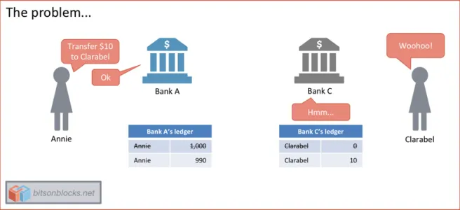
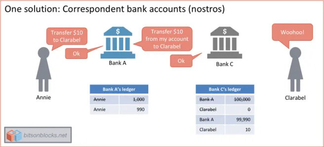
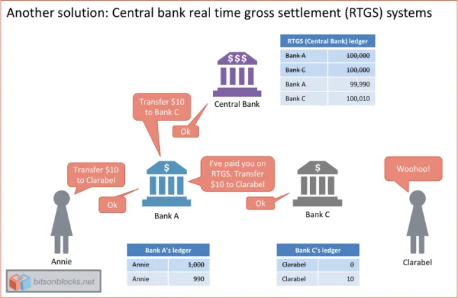
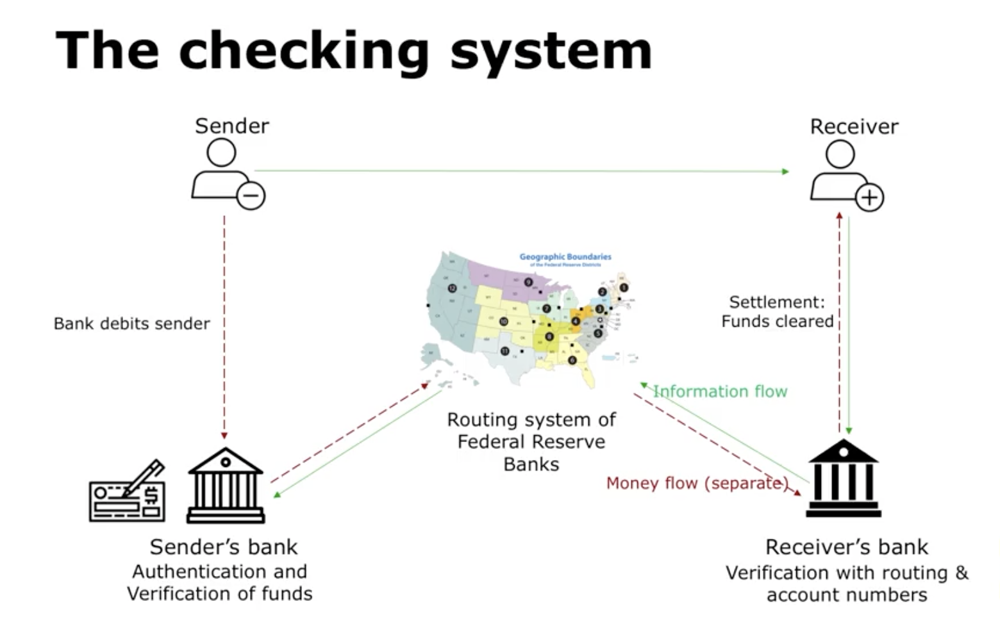
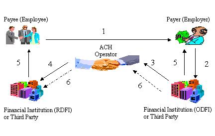

```{r setup, include=FALSE}
options(htmltools.dir.version = FALSE)
library(knitr)
opts_chunk$set(
  fig.align="center",  
  fig.height=4, #fig.width=6,
  # out.width="748px", #out.length="520.75px",
  dpi=300, #fig.path='Figs/',
  cache=T#, echo=F, warning=F, message=F
  )
library(tidyverse)
library(hrbrthemes)
library(fontawesome)
library(tufte)
```

# Learning Outcomes

 - ## How do existing payments systems work?

--

 - ## Identify key inefficiencies, and...

--

 - ## Connect techincal advantages of PayTech innovations to these inefficiencies

---

# Table of contents 


# 2.01 [Retail Payment Systems](#Retail Payment Systems)

### 2.02 [Digital Wallets](#Digital Wallets)

### 2.03 [Credit Card Innovations](#Credit Card Innovations)

---

class:  inverse, center, middle
name: Retail Payment Systems

#  2.01: PayTech | Retail Payment Systems

<html><div style='float:left'></div><hr color='#EB811B' size=1px width=796px></html>

---

# Outline

- ## 2.0: PayTech | Retail Payment Systems
  + ### Checking System
  + ### ACH
  
---

#Retail Payments  
 - ### usually involve C2C, C2B transactions 
  - #### or B2B transactions (wholesale payments)
  - #### higher transaction volumes and lower average dollar values than wholesale payment systems

--
 - ### where purchase of goods and services can occur:
    - #### at the point-of-sale (POS) (e.g., in person at a merchant, or unattended kiosks) 
    - #### remotely without physical presence at the POS, such as via the Internet or a telephone/mobile phone. 
    
--

- ### and occur through the use of various instruments
  - #### cash, checks, EFT, debit cards, credit cards, mobile phones...

---

# Consider writing a check instead of paying cash for a purchase
.center[]

---

# Check Clearing and Settlement
.center[]
---

# Check Clearing and Settlement
.center[]
---

# Check Clearing and Settlement inovlves two flows:
  
.center[]
--

- ## Flow of information (clearing)
- ## Flow of money (settlement)

---

# Compared to cash payments, these two flows are not synchronous!
- ## You get **information** that you will be paid before you are **actually paid**

--

- ## Time separation can result in fraud!
  
.center[]
--

- ## Transaction failure due to asymmetric information
  
---

# Who provides the trust that you will get paid?

--

- ## **Financial intermediaries** 
  - ### solve the asymmetric information problem by putting in safeguards like,
      - #### reversibility of payments
      - #### pre-authorization of funds
      - #### electronic routing
      - #### advanced encryption etc.

---

# But trust does not come free!

- ## Banks charge transaction fees like
  - ### overdraft fee
  - ### returned check/insufficient funds fees
  - ### minimum checking account balance etc.
  
> # PayTech is about attacking this pain point -  reducing transaction costs
  
---

# Now Consider using EFT intead of writing a check 

- ### EFT - Electronic Fund Transfer (eg. direct deposit, online payments)
- ### Uses ACH - Automated Clearing House network instead of the checking system
  - ### An electronic communication system that plugs in to the existing payment infrastructure
  - ### ACH network is run by the central bank (Fed), and a private company called the Clearing House

---

# EFT using ACH

 .center[]
 
Solid lines represent the flow of information and dashed lines represent the flow of funds.

---

# Advantages of ACH over Checking system

- ## Cuts down time lage between information flow and money flow
- ## Low cost - through batch processing

> # The low cost of ACH is a primary reason which most PayTech innovations are built on the ACH system

---

# Disadvantage of the ACH system

- ## Not very easy to use
- ## User identifiers (routing/account number) take long to retrieve
- ## Different banks and merchants have different user interfaces (not very user friendly)

> # PayTech innovations take good, but not user-friendly infrastructure, and build user-friendly interfaces on top of it

---

# User friendly Wrappers

- ## User identifiers (phone numbers, email addresses)
  - ### Who remembers routing and account numbers?!
- ## Biometric authentication (face or touch id)
  - ### cumbersome bank level authentication
  
---

# Digital Wallets are....
> # these **wrappers** 

- ## They are built on existing *legacy* infrastructure
- ## They take such information and convert them back into a format that is compatible with existing infrastructure

- ## eg. PayPal, Venmo, Apple Pay, AliPay...


