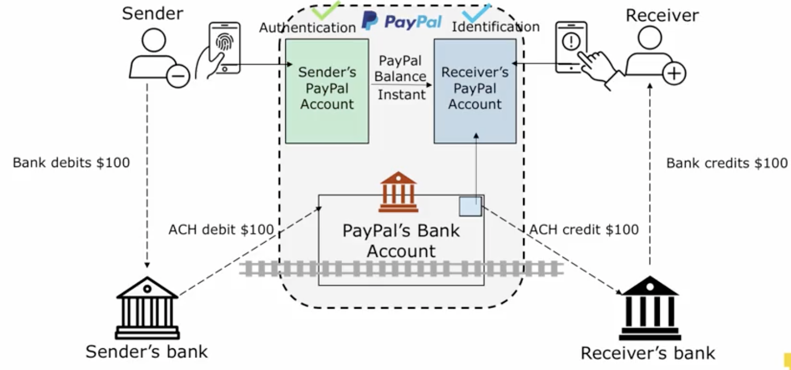
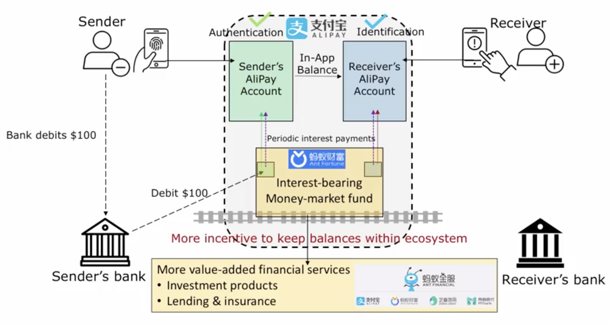
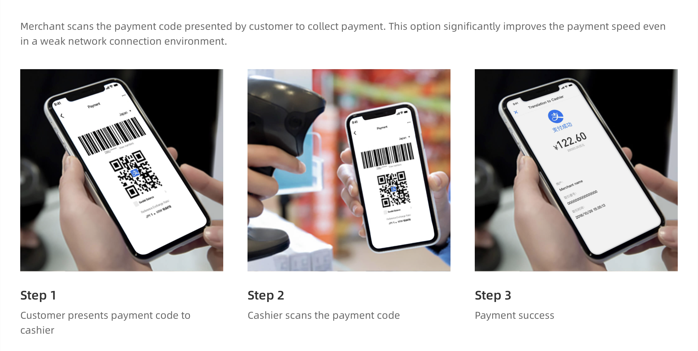
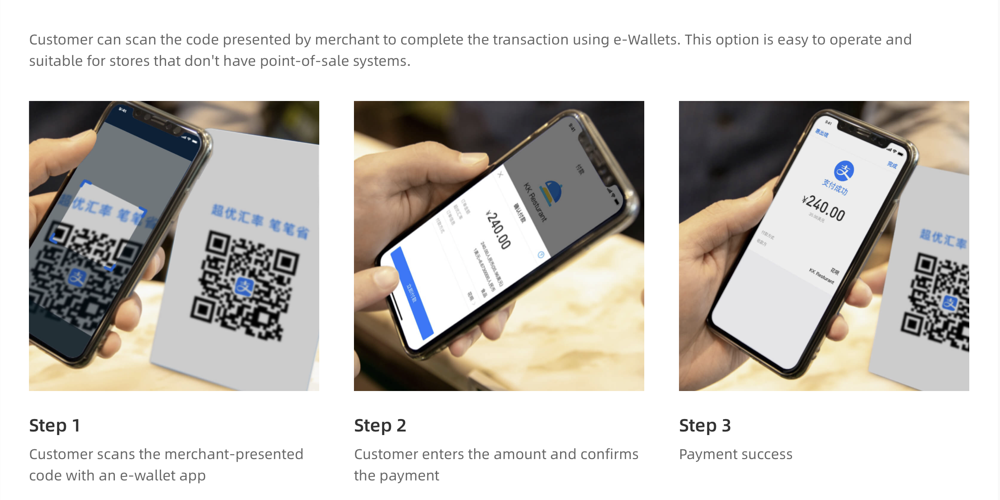
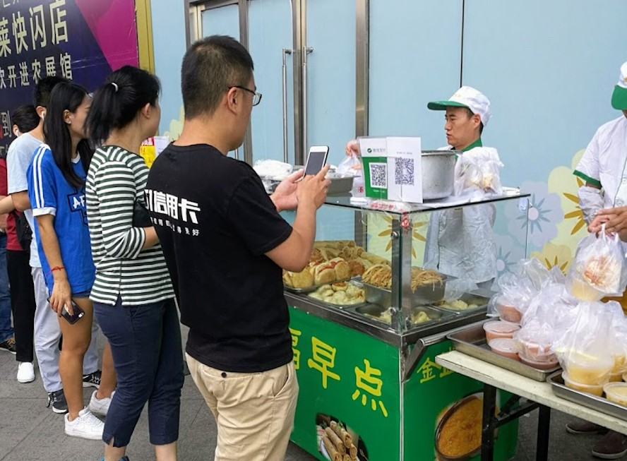
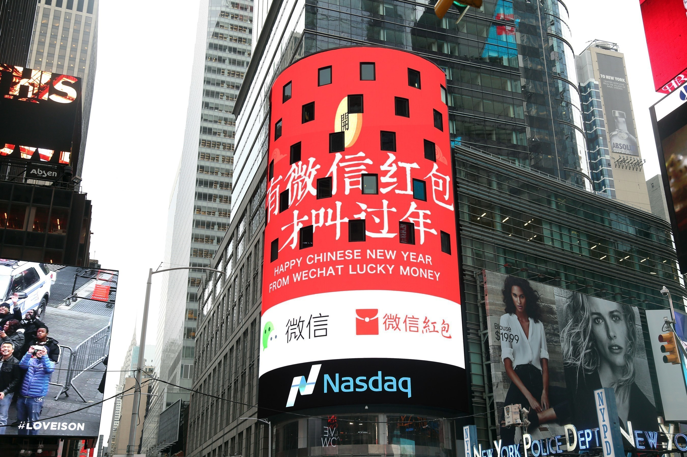
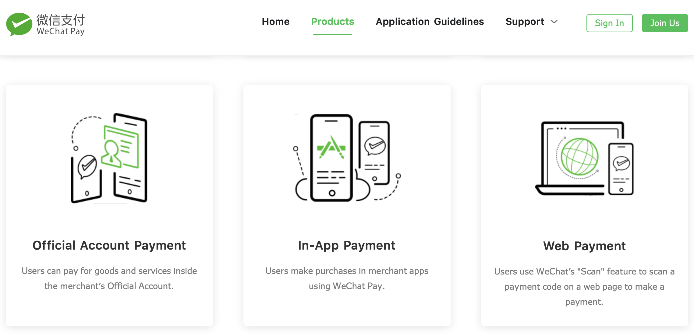
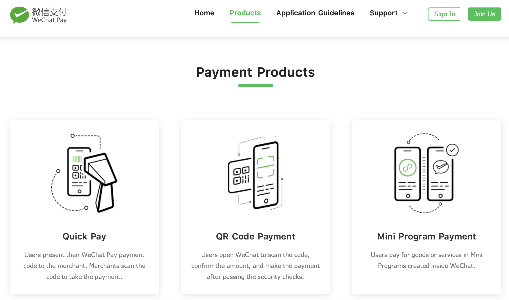

```{r setup, include=FALSE}
options(htmltools.dir.version = FALSE)
library(knitr)
opts_chunk$set(
  fig.align="center",  
  fig.height=4, #fig.width=6,
  # out.width="748px", #out.length="520.75px",
  dpi=300, #fig.path='Figs/',
  cache=T#, echo=F, warning=F, message=F
  )
library(tidyverse)
library(hrbrthemes)
library(fontawesome)
library(tufte)
```

---

# Learning Outcomes

--

 - ## How do existing payments systems work?
 
--

 - ## Identify key inefficiencies, and...
 
--

 - ## Connect techincal advantages of PayTech innovations to these inefficiencies

---

# Table of contents 


### 2.01 [Retail Payment Systems](#Retail Payment Systems)

# 2.02 [Digital Wallets](#Digital Wallets)

### 2.03 [Credit Card Innovations](#Credit Card Innovations)

---

class:  inverse, center, middle
name: Retail Payment Systems

#  2.02: PayTech | Digital Wallets

<html><div style='float:left'></div><hr color='#EB811B' size=1px width=796px></html>

---

# Outline

 - ## 2.02: PayTech | Digital Wallets 
  + ### Pure: PayPal
  + ### Hybrid (Payment + additional financial services): AliPay
  + ### Hybrid (Payment + social network): Facebook, WeChat

---

# Pure Digital Wallet: PayPal
 + ### How does the tech work
 + ### What is the business model
 + ### Room for improvement
  

---

# Regular vs. Digital Wallet
  + ### bank account still the source of money - connection is digital instead of physical
  + ### You put money in your wallet - virtually transfer from connected bank 
  + ### You pay others - digitally send money into the virtual wallet of other PayPal users using friendly user identifiers like phone numbers,

--
# Except, 

  + ### Actual money follows later using conventional rails like ACH
  
---

# How PayPal operates


.center[]
> - ### PayPal has a bank account but is **not** a bank; performs a custodial role

---

# Key Points
- ## Decoupling
  - ### Information flow is in the form of virtual money balances within PayPal
  - ### Money flows through existing payment rail - ACH
 
- ## Efficiencies
  - ### Banks do what they are best at - moving money efficiently and securely
  - ### Techs do what they are good at - information processing and basic authentication 

---

# Business model 

  - ### Using the system is free
  - ### Initially imposed withdrawal fee - moving wallet balance back to bank, but now,
      - ### Free to most consumers (Premium for *instant* withdrawal)
      - ### Charge merchants
      - ### Charge on credit card based balance transfers

---

# Revenue

- ## Draws in and keeps the most **price-sensitive** customers
- ## And maintains margins by charging merchants a slightly higher rate (2-3% per transaction)

---

# Costs

- ## Fixed cost **low** 
  - ### Uses existing hardware (existing payment rail); only software development
- ## Variable costs, also **low**
  - ### Not a bank - so no regulatory costs
  - ### maintenance of wallet-linked bank accounts and compliance - responsibility of bank partner

---

# Profitablity

- ## Marginal costs of processing one more transaction are minimal - **Scalable!**
- ## Stable revenue +  low fixed and marginal cost = **high** profit margin (relative to traditional financial institution)

---

# Limitation of pure digital wallets
- ## Competition high - build one with a software development team and bank partner
- ## Revenue model - make money by keeping money in digital wallets and transacting, but no incentive for consumer to keep money in wallet!
- ## Targeted toward e-commerce; tough to use in brick and mortar places

---

# Hybrid Digital Wallet: AliPay
- ## PayPal equivalent in China (subsidiary of Alibaba)
- ## AliPay = eBay + Amazon

---

# How AliPay operates - Innovation 1

.center[]
> ## Partner is a **Money Market Fund** instead of a bank

---

# Business model
- ## Incetivize users to stay - positive interest rate
- ## But why stop there?  -- ** Ant Financial!**
  - ## Further connect MMA with more investment options like P2P lending, brokerage, insurance
  
> # Digital wallet becomes a full-service ecosystem centered around the wallet!

---

# How AliPay operates - Innovation 2

.center[]

---

# How AliPay operates - Innovation 2

.center[]

---

# How AliPay operates - Innovation 2

.center[]


---

# Business model
- ## Expand wallet to **offline F2F settings** - QR code scanning
  - ### Expands market to others (not millenials!) who don't do much online shopping
  - ### No need for expensive credit card terminal. All merchant/consumer info is embedded in QR code 
  - ### No hardware required except for a smartphone!
  - ### Great for emerging markets with lot of offline transactions and without a robust credit card network
  
---

# Hybrid Digital Wallet + Social Network
- ## Derived from, or embedded in social networks
  - ### Venmo: payment platform that adds a layer of social meaning
  - ### WeChat: Social network that grows a payment platform from within
- ## Tech identical to digital wallet - user interface wrapper around existing payment rails
- ## Use social networks to grow the payment ecosystem (innovation is the business site)

---

# Venmo (part of PayPal now)
- ## Combine social element and the financial element of a single financial transaction
  - ### Splitting a bar tab + turning it into a social network status update
- ## Financial overlay 
  - ### Avoids awkwardness
  - ### Increases the value of the social network

---

# Venmo (part of PayPal now)
- ## Monetiztion
  - ### Mining financial transactions data on social network to gain insight into financial profiles
  - ### Provide customized financial products based on insight
  - ### Data privacy is a big issue
  
- ## Venmo has not systematically started monetizing yet....

---

# WeChat (part of Tencent)

- ## Chinese equivaluent of Facebook + WhatsApp
- ## Overlay payment services on top of existing social network = WeChat Pay
  - ### User identifiers = network handles
  - ### Money flows through traditional payment rails
  - ### Key innovation - getting users to use it
      

---
# WeChat Pay: Launch Lucky Money Campaign
.center[]

---

# WeChat Pay: Follow up  
- ### marketplace (like Facebook marketplace)
.center[]

---

# WeChat Pay
- ### Full fledged platform competing with AliPay
.center[]


