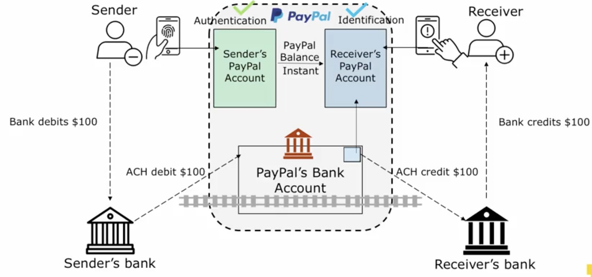
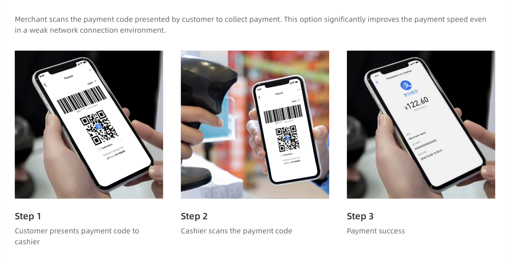
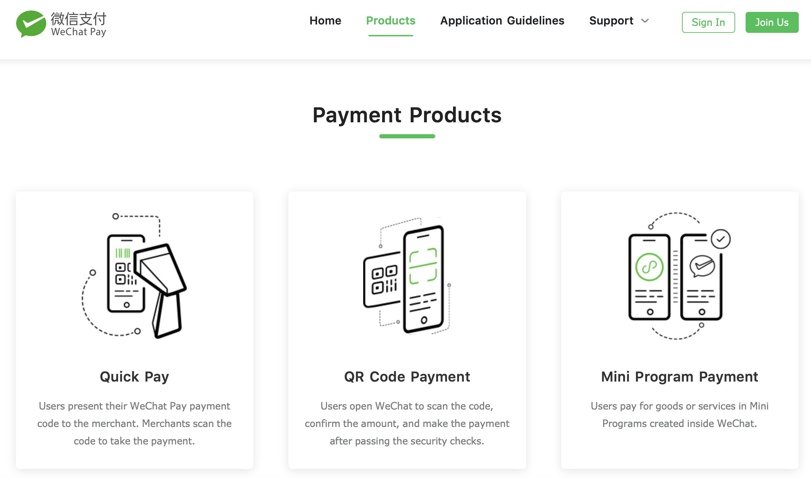

```{r setup, include=FALSE}
options(htmltools.dir.version = FALSE)
library(knitr)
opts_chunk$set(
  fig.align="center",  
  fig.height=4, #fig.width=6,
  # out.width="748px", #out.length="520.75px",
  dpi=300, #fig.path='Figs/',
  cache=T#, echo=F, warning=F, message=F
  )
library(tidyverse)
library(hrbrthemes)
library(fontawesome)
library(tufte)
```

# Learning Outcomes

--

 - ## How do existing credit card systems work?
 
--

 - ## Identify key inefficiencies, and...
 
--

 - ## Connect techincal advantages of PayTech innovations to these inefficiencies

---

# Table of contents 


### 2.01 [Retail Payment Systems](#Retail Payment Systems)

### 2.02 [Digital Wallets](#Digital Wallets)

# 2.03 [Credit Card Innovations](#Credit Card Innovations)

---

class:  inverse, center, middle
name: Retail Payment Systems

#  2.03: PayTech | Credit Card Innovations

<html><div style='float:left'></div><hr color='#EB811B' size=1px width=796px></html>

---

# Outline

- ## 2.03: PayTech | Credit Card Innovations
  + ### Origins of Credit Card Networks
  + ### Key stakeholders and business model
  + ### Identify inefficiencies
  + ### Tech innovations in security
  + ### Expanding card usage
  
---

#Origins of Credit Cards  
- ## Checks (and e-checks/ACH) are not an optimal or time-critical transactions 
  - ### Settlement (transfer of money) is not real time!
      - #### Think of paying for dinner at a restaurant using paper checks or wire-transfer!
- ## Quicker solution? Bank temporarily fronts the money for the purchase - Instant cashless transactions!
    - ### Digital wallets speed up the process, but credit cards were first! 


---

# Credit Card Operation
- ## Bank extends revolving line of credit to customer
- ## Guarantees real-time availability of funds to merchant
- ## Builds a real-time messaging network to communicate this guarantee
- ## Bills customer later (and bears default risk)
- ## Charges merchant for these costs

---

# Original: Diner's Card (now part of Discover)


---

# Next Gen: Bank Alliances and Electronic Networks

.center[]

---

# Credit Card Network: Technology and Players
.center[]

???

- There are four parties involved, the paying consumer, the receiving merchant, and their banks. We will call the consumer's bank the issuer because they issue the credit card and the underlying loan. The merchant's bank is called the acquirer and that's where the merchant has their bank accounts to receive money. And in the middle as usual, we'll have an electronic communications network. Now we'll use Visa as the example.

- The consumer first applies for a revolving line of credit from the bank.

- Once approved, the bank will issue them a credit card that has their credit account information, that is the card number and the expiration date printed on the card and embedded in the chip and the magnetic stripe.

- Now, the consumer takes it to a store., swipes it to buy a hundred dollars worth of stuff. In order to do that, we're going to need an additional sixth party involved called the processors. They are the providers of the terminal,the hardware, and the software to capture the card information and send it onward to the card network. They can be either affiliated with incumbent financial institutions or they can be fintech startups acting as independent sales organizations or ISOs.

- Swiping or inserting the card itself simply sends the account information combined with a payment amount information by the processor's hardware and software, in an encrypted form to the network like a text message.

- The network itself then simply forward the message to the issuer. It is not an ACH Network -- there's no batch processing here and every message is routed through in real time just like a cell phone network.

- Once the information gets to the issuer, the issuer performs several key intermediation tasks in quick succession -  verify that the consumer has the account, the charge does not exceed the amount of the available loan, and do a quick risk assessment about how likely this transaction might be fraudulent,  Once everything checks out, the issuer sends an approval message which will again be routed through the card network to the merchant showing up as approved on the processing device and maybe printing a receipt.

- All of these are highly automated and would happen within a couple of seconds. Then the consumer conveniently takes the product home and their business withthe merchant is concluded.

- As usual,this is only half of the picture. As settlement, the actual money flow happens later on
other rails either ACH or bank wire. 

---

# Credit Card Network: Payment for services
.center[]

???

---

# Compared to cash payments, these two flows are not synchronous!
- ## You get **information** that you will be paid before you are **actually paid**

--

- ## Time separation can result in fraud!
  
    
--

- ## Transaction failure due to asymmetric information
  
---

# Who provides the trust that you will get paid?

--

- ## **Financial intermediaries** 
  - ### solve the asymmetric information problem by putting in safeguards like,
      - #### reversibility of payments
      - #### pre-authorization of funds
      - #### electronic routing
      - #### advanced encryption etc.

---

# But trust does not come free!

- ## Banks charge transaction fees like
  - ### overdraft fee
  - ### returned check/insufficient funds fees
  - ### minimum checking account balance etc.
  
> # PayTech is about attacking this pain point -  reducing transaction costs
  
---

# Now Consider using EFT intead of writing a check 

- ### EFT - Electronic Fund Transfer (eg. direct deposit, online payments)
- ### Uses ACH - Automated Clearing House network instead of the checking system
  - ### An electronic communication system that plugs in to the existing payment infrastructure
  - ### ACH network is run by the central bank (Fed), and a private company called the Clearing House

---

# EFT using ACH

 
 
Solid lines represent the flow of information and dashed lines represent the flow of funds.

---

# Advantages of ACH over Checking system

- ## Cuts down time lage between information flow and money flow
- ## Low cost - through batch processing

> # The low cost of ACH is a primary reason which most PayTech innovations are built on the ACH system

---

# Disadvantage of the ACH system

- ## Not very easy to use
- ## User identifiers (routing/account number) take long to retrieve
- ## Different banks and merchants have different user interfaces (not very user friendly)

> # PayTech innovations take good, but not user-friendly infrastructure, and build user-friendly interfaces on top of it

---

# User friendly Wrappers

- ## User identifiers (phone numbers, email addresses)
  - ### Who remembers routing and account numbers?!
- ## Biometric authentication (face or touch id)
  - ### cumbersome bank level authentication
  
---

# Digital Wallets are....
> # these **wrappers** 

- ## They are built on existing *legacy* infrastructure
- ## They take such information and convert them back into a format that is compatible with existing infrastructure

- ## eg. PayPal, Venmo, Apple Pay, AliPay...

---

class:  inverse, center, middle
name: Digital Wallets

#  PayTech|2.01: Digital Wallets

<html><div style='float:left'></div><hr color='#EB811B' size=1px width=796px></html>

---

# 2.01: PayTech | Digital Wallets
## Outline
  + ### Pure: PayPal
  + ### Hybrid (Payment + additional financial services): AliPay
  + ### Hybrid (Payment + social network): Facebook, WeChat

---

# Pure Digital Wallet: PayPal
 + ### How does the tech work
 + ### What is the business model
 + ### Room for improvement
  

---

# Regular vs. Digital Wallet
  + ### bank account still the source of money - connection is digital instead of physical
  + ### You put money in your wallet - virtually transfer from connected bank 
  + ### You pay others - digitally send money into the virtual wallet of other PayPal users using friendly user identifiers like phone numbers,

--
# Except, 

  + ### Actual money follows later using conventional rails like ACH
  
---

# How PayPal operates



> - ### PayPal has a bank account but is **not** a bank; performs a custodial role

---

# Key Points
- ## Decoupling
  - ### Information flow is in the form of virtual money balances within PayPal
  - ### Money flows through existing payment rail - ACH
 
- ## Efficiencies
  - ### Banks do what they are best at - moving money efficiently and securely
  - ### Techs do what they are good at - information processing and basic authentication 

---

# Business model 

  - ### Using the system is free
  - ### Initially imposed withdrawal fee - moving wallet balance back to bank, but now,
      - ### Free to most consumers (Premium for *instant* withdrawal)
      - ### Charge merchants
      - ### Charge on credit card based balance transfers

---

# Revenue

- ## Draws in and keeps the most **price-sensitive** customers
- ## And maintains margins by charging merchants a slightly higher rate (2-3% per transaction)

---

# Costs

- ## Fixed cost **low** 
  - ### Uses existing hardware (existing payment rail); only software development
- ## Variable costs, also **low**
  - ### Not a bank - so no regulatory costs
  - ### maintenance of wallet-linked bank accounts and compliance - responsibility of bank partner

---

# Profitablity

- ## Marginal costs of processing one more transaction are minimal - **Scalable!**
- ## Stable revenue +  low fixed and marginal cost = **high** profit margin (relative to traditional financial institution)

---

# Limitation of pure digital wallets
- ## Competition high - build one with a software development team and bank partner
- ## Revenue model - make money by keeping money in digital wallets and transacting, but no incentive for consumer to keep money in wallet!
- ## Targeted toward e-commerce; tough to use in brick and mortar places

---

# Hybrid Digital Wallet: AliPay
- ## PayPal equivalent in China (subsidiary of Alibaba)
- ## AliPay = eBay + Amazon

---

# How AliPay operates - Innovation 1


> ## Partner is a **Money Market Fund** instead of a bank

---

# Business model
- ## Incetivize users to stay - positive interest rate
- ## But why stop there?  -- ** Ant Financial!**
  - ## Further connect MMA with more investment options like P2P lending, brokerage, insurance
  
> # Digital wallet becomes a full-service ecosystem centered around the wallet!

---

# How AliPay operates - Innovation 2



---

# How AliPay operates - Innovation 2


---

# How AliPay operates - Innovation 2


---

# Business model
- ## Expand wallet to **offline F2F settings** - QR code scanning
  - ### Expands market to others (not millenials!) who don't do much online shopping
  - ### No need for expensive credit card terminal. All merchant/consumer info is embedded in QR code 
  - ### No hardware required except for a smartphone!
  - ### Great for emerging markets with lot of offline transactions and without a robust credit card network
  
---

# Hybrid Digital Wallet + Social Network
- ## Derived from, or embedded in social networks
  - ### Venmo: payment platform that adds a layer of social meaning
  - ### WeChat: Social network that grows a payment platform from within
- ## Tech identical to digital wallet - user interface wrapper around existing payment rails
- ## Use social networks to grow the payment ecosystem (innovation is the business site)

---

# Venmo (part of PayPal now)
- ## Combine social element and the financial element of a single financial transaction
  - ### Splitting a bar tab + turning it into a social network status update
- ## Financial overlay 
  - ### Avoids awkwardness
  - ### Increases the value of the social network

---

# Venmo (part of PayPal now)
- ## Monetiztion
  - ### Mining financial transactions data on social network to gain insight into financial profiles
  - ### Provide customized financial products based on insight
  - ### Data privacy is a big issue
  
- ## Venmo has not systematically started monetizing yet....

---

# WeChat (part of Tencent)

- ## Chinese equivaluent of Facebook + WhatsApp
- ## Overlay payment services on top of existing social network = WeChat Pay
  - ### User identifiers = network handles
  - ### Money flows through traditional payment rails
  - ### Key innovation - getting users to use it
      

---
# WeChat Pay: Launch Lucky Money Campaign


---

# WeChat Pay: Follow up  
- ### marketplace (like Facebook marketplace)


---

# WeChat Pay
- ### Full fledged platform competing with AliPay

